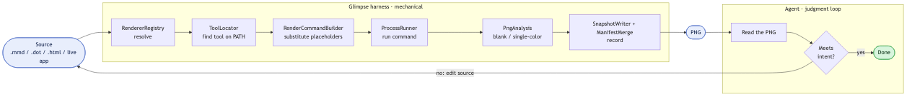

# Glimpse

> A renderer-agnostic **visual-feedback harness**: render any UI or diagram to a PNG, *look* at it, critique, improve, repeat.

Code agents are good at writing UI and diagrams — but they can't *see* the result, so they iterate blind. Glimpse closes that loop. It turns any artifact into a PNG through a uniform pipeline, runs cheap mechanical checks (blank / single-color / missing render), and records it so an agent (or you) can read the image, judge it against intent, fix the source, and re-render until it's right.

The judgment stays human (or agent); Glimpse just makes every turn fast, stable, and honest.



## How it works

A renderer is just **a command that writes a PNG to a path** — so adding one is configuration, not code. The harness resolves the renderer, runs its command, analyses the output, and records it:

| Source | Renderer | Underlying tool |
|--------|----------|-----------------|
| `.mmd` / `.mermaid` | `mermaid` | [mermaid-cli](https://github.com/mermaid-js/mermaid-cli) (`mmdc`) |
| `.dot` / `.gv` | `graphviz` | Graphviz (`dot`) |
| `.d2` | `d2` | [D2](https://d2lang.com) (`d2`) |
| `.html` / `.htm` | `web` | headless Chrome |
| live macOS window | `app` | `screencapture` |

The renderer is inferred from the file extension, or set explicitly with `--renderer`.

## Quick start

Requires **.NET 10** and the tool for whichever renderer you use (the CLI fails fast with an install hint if one is missing).

```bash
# Render a mermaid diagram (renderer inferred from .mmd)
dotnet run --project tools/Glimpse.Capture -- diagram.mmd --name my-diagram

# Explicit renderer, dark theme, custom size
dotnet run --project tools/Glimpse.Capture -- page.html --renderer web --theme dark --size 1440x900

# Screenshot a live macOS window
dotnet run --project tools/Glimpse.Capture -- --renderer app --window-id 42 --name app-shot
```

The CLI prints the absolute PNG path, the status (`ok` / `failed`), any warnings, and the manifest location:

```
PNG:      /…/.claude/tmp/ui-snapshots/glimpse/my-diagram.png
Status:   ok (1264x136)
Manifest: /…/.claude/tmp/ui-snapshots/glimpse/manifest.json
```

### Flags

| Flag | Meaning |
|------|---------|
| `--renderer <name>` | Force a renderer instead of inferring from the extension |
| `--name <name>` | Stable output name (re-renders overwrite — no accumulation) |
| `--out <dir>` | Output directory (default: per-repo `.claude/tmp/ui-snapshots/glimpse/`) |
| `--theme light\|dark` | Theme passed to renderers that support it |
| `--size WxH` | Render dimensions, e.g. `1280x800` |
| `--window-id <n>` | Window id for the `app` renderer |
| `--prune` | Delete stale PNGs from previous runs |

**Exit codes:** `0` rendered clean · `1` rendered with warnings · `2` render failed.

## The agent loop

Glimpse ships a [`glimpse` skill](.claude/skills/glimpse/SKILL.md) that packages the loop for coding agents:

1. **Render** the source to a PNG.
2. **Read** the PNG — actually look at it.
3. **Check warnings** — a blank/single-color result means the *pipeline* broke (missing font, bad source), not the design.
4. **Judge** against intent: layout, overlap, clipped/tofu text, legibility.
5. **Improve** the source and re-render (same `--name` overwrites).
6. **Stop** when it meets intent and warnings are clean.

The architecture diagram above was produced by running exactly this loop on Glimpse itself.

## Project layout

```
src/
  Glimpse.Abstractions/          framework-free primitives (themes, sizes)
  Glimpse.Core/                  the harness: renderer registry, command builder,
                                 process runner, render engine, PNG analyser,
                                 manifest + output writer
  Glimpse.Avalonia*/             headless Avalonia rendering engine (optional renderer)
tools/
  Glimpse.Capture/               the CLI
tests/                           xUnit suites incl. a real end-to-end render gate
docs/
  superpowers/                   design spec + implementation plan
  diagrams/                      architecture diagram (source + rendered PNG)
```

`Glimpse.Core` is intentionally framework-free; the Avalonia headless engine is a separate, optional renderer for snapshotting Avalonia controls in-process.

## Building and testing

```bash
dotnet build Glimpse.slnx
dotnet test
```

The test suite includes a real mermaid end-to-end gate that renders an actual diagram and asserts it's non-blank (it skips automatically if `mmdc` isn't installed).

## License

No license yet — all rights reserved until one is added.
