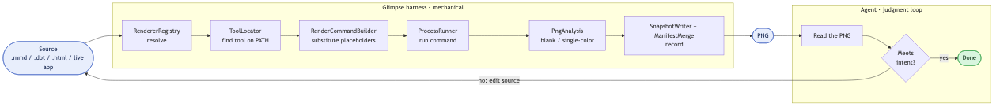

# Glimpse

> A renderer-agnostic **visual-feedback harness**: render any UI or diagram to a PNG, *look* at it, critique, improve, repeat.

Code agents are good at writing UI and diagrams — but they can't *see* the result, so they iterate blind. Glimpse closes that loop. It turns any artifact into a PNG through a uniform pipeline, runs cheap mechanical checks (blank / single-color / missing render), and records it so an agent (or you) can read the image, judge it against intent, fix the source, and re-render until it's right.

The judgment stays human (or agent); Glimpse just makes every turn fast, stable, and honest.



## Install

Requires the **.NET 10 SDK** on Windows or macOS, plus the tool for whichever renderer you use (see
[Platforms](#platforms)).

**As a Claude Code plugin** (the CLI plus the `glimpse` and `diagram-design` skills):

```
/plugin install glimpse --marketplace purin-tavilsup/Glimpse
```

On Claude Code older than 2.1.275, add the marketplace first:
`/plugin marketplace add purin-tavilsup/Glimpse`, then `/plugin install glimpse@glimpse`.

The plugin pins a released CLI version. Its first run downloads that version from NuGet through
`dotnet dnx` and later runs use the local copy.

**As a .NET tool**, without Claude Code: `dotnet tool install -g Glimpse.Capture`, or run it once with
`dotnet dnx Glimpse.Capture`. The command is `glimpse`.

**From a clone**, to work on Glimpse itself: `./scripts/install.sh` (macOS, a symlink) or
`./scripts/install.ps1` (Windows, a junction, so no admin needed; it also puts `glimpse` on your user
PATH) links the plugin to your clone, so `glimpse` runs the code you are editing: it rebuilds whenever the source changed.

## How it works

A renderer is just **a command that writes a PNG to a path** — so adding one is configuration, not code. The harness resolves the renderer, runs its command, analyses the output, and records it:

| Source | Renderer | Underlying tool |
|--------|----------|-----------------|
| `.mmd` / `.mermaid` | `mermaid` | [mermaid-cli](https://github.com/mermaid-js/mermaid-cli) (`mmdc`) |
| `.dot` / `.gv` | `graphviz` | Graphviz (`dot`) |
| `.d2` | `d2` | [D2](https://d2lang.com) (`d2`) |
| `.html` / `.htm` | `web` | headless Chrome |
| live app window | `app` | macOS `screencapture` · Windows GDI (in-process) |

The renderer is inferred from the file extension, or set explicitly with `--renderer`.

## Platforms

Glimpse runs on **macOS and Windows**. All five renderers work on both; only the
underlying mechanism differs, and only for `app`:

| | macOS | Windows |
|---|---|---|
| `app` capture | `screencapture` | in-process GDI (`PrintWindow`) |
| Permission needed | Screen Recording, for `app` | none |
| Diagram tools | `brew install graphviz d2` | `winget install Graphviz.Graphviz Terrastruct.d2` |

`mmdc` is `npm i -g @mermaid-js/mermaid-cli` on both. Linux is untested and unclaimed —
diagram renderers should work, `app` will not.

CI builds and runs the unit tests on both OSes. That proves both compile and the shared logic
passes; it does not prove live capture, which needs a real desktop and is verified by hand.

## Quick start

If a renderer's tool is missing, the CLI stops with a hint on how to install it.

```bash
# Render a mermaid diagram (renderer inferred from .mmd)
glimpse diagram.mmd --name my-diagram

# Explicit renderer, dark theme, custom size
glimpse page.html --renderer web --theme dark --size 1440x900

# Screenshot a live app window by name (macOS and Windows)
glimpse --renderer app --window "Chrome" --name app-shot

# List capturable windows and their ids
glimpse --list-windows
```

The target window must be visible and not minimized. `--list-windows` marks the rows `--window`
can never pick as `(not selectable)`; on Windows that is most of them, since it lists every
top-level window, including untitled ones (apps that draw their own title bar leave it empty).

The CLI prints the absolute PNG path, the status (`ok` / `failed`), any warnings, and the manifest location:

```
PNG:      /…/.claude/tmp/ui-snapshots/glimpse/my-diagram.png
Status:   ok (1264x136)
Manifest: /…/.claude/tmp/ui-snapshots/glimpse/manifest.json
```

### Flags

| Flag | Meaning |
|------|---------|
| `--renderer <name>` | Force a renderer instead of inferring from the extension |
| `--name <name>` | Stable output name (re-renders overwrite — no accumulation) |
| `--out <dir>` | Output directory (default: per-repo `.claude/tmp/ui-snapshots/glimpse/`) |
| `--theme light\|dark` | Theme passed to renderers that support it |
| `--size WxH` | Render dimensions, e.g. `1280x800` |
| `--window <app>` | Capture the frontmost window whose app name contains this (implies `app`) |
| `--title <text>` | With `--window`, also require the window title to contain this |
| `--window-id <n>` | Exact window to capture (CGWindowID on macOS, HWND on Windows); needs `--renderer app` |
| `--list-windows` | Print the windows (on-screen ones on macOS, every top-level window on Windows) with id, layer and size, then exit |
| `--prune` | Delete stale PNGs from previous runs |
| `--no-manifest` | Don't write `manifest.json` — handy for one-off renders into a folder you don't want cluttered (e.g. `docs/`) |
| `-h`, `--help` | Print usage, then exit |
| `--version` | Print the CLI version, then exit |

**Exit codes:** `0` rendered clean · `1` rendered with warnings · `2` render failed or bad arguments.

## The agent loop

The plugin ships two skills: [`diagram-design`](plugin/skills/diagram-design/SKILL.md) helps an agent
design a clear diagram, and [`glimpse`](plugin/skills/glimpse/SKILL.md) packages the loop that checks it
(or any UI):

1. **Render** the source to a PNG.
2. **Read** the PNG — actually look at it.
3. **Check warnings** — a blank/single-color result means the *pipeline* broke (missing font, bad source), not the design.
4. **Judge** against intent: layout, overlap, clipped/tofu text, legibility.
5. **Improve** the source and re-render (same `--name` overwrites).
6. **Stop** when it meets intent and warnings are clean.

The architecture diagram above was produced by running exactly this loop on Glimpse itself.

## Project layout

```
src/
  Glimpse.Abstractions/          framework-free primitives (themes, sizes)
  Glimpse.Core/                  the harness: renderer registry, command builder,
                                 process runner, render engine, PNG analyser,
                                 manifest + output writer
  Glimpse.Avalonia*/             headless Avalonia rendering engine (optional renderer)
tools/
  Glimpse.Capture/               the CLI, packed as the Glimpse.Capture .NET tool
plugin/                          the Claude Code plugin: bin/ wrappers + the two skills
.claude-plugin/                  marketplace manifest, so the repo is installable
samples/
  Glimpse.ScratchConsole/        scratch app for trying the Avalonia renderer
scripts/                         clone installers + a diagram-template check
tests/                           xUnit suites incl. a real end-to-end render gate
assets/                          logo
docs/
  superpowers/                   design specs + implementation plans
  diagrams/                      architecture diagram (source + rendered PNG)
```

`Glimpse.Core` is intentionally framework-free; the Avalonia headless engine is a separate, optional renderer for snapshotting Avalonia controls in-process.

## Building and testing

```bash
dotnet build Glimpse.slnx
dotnet test Glimpse.slnx
```

The test suite includes a real mermaid end-to-end gate that renders an actual diagram and asserts it's non-blank (it skips automatically if `mmdc` isn't installed).
Tests in `Category=RealDesktop` capture real windows, so they need a desktop session; CI runs
`--filter "Category!=RealDesktop"`.

## Releasing

Set the same version in `tools/Glimpse.Capture/Glimpse.Capture.csproj`, `plugin/.claude-plugin/plugin.json`
and `plugin/bin/glimpse.version`, merge, then push a `v<version>` tag. The release workflow refuses
mismatched versions, runs the tests, checks the package through `dotnet dnx` on Windows and macOS, and
publishes it to NuGet.

Push the tag straight after merging the version bump: the plugin on `main` already pins the new version,
so a fresh install fails with "not found" until it is on NuGet. nuget.org also lists a new version in
stages, and `dnx` finds it only at the last one. For 0.1.0 that took about ten minutes after publishing.
NuGet's local HTTP cache can keep an earlier "not found" for about half an hour, so when checking a
release, point `NUGET_HTTP_CACHE_PATH` at an empty folder.

## License

[MIT](LICENSE) © 2026 Purin Tavilsup
